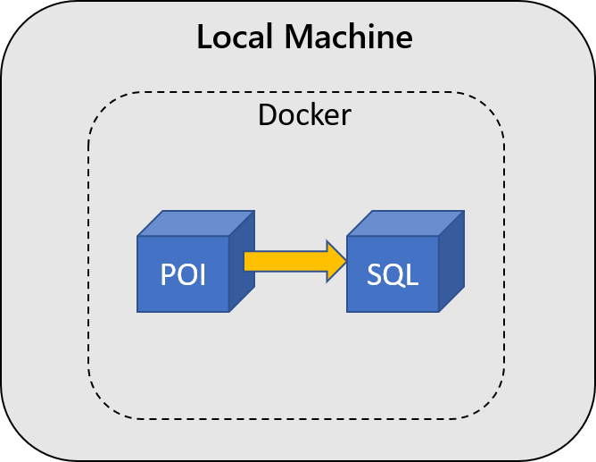

# But First, Containers

Containers have been adopted as a great way to alleviate portability issues. They form the core of this OpenHack and underpin everything you'll be exploring as you progress through the challenges.

The objective of this challenge sets out to ensure you understand the very basics of containers, can work with them locally and push them to a container image repository.

## Challenge

You've been tasked with improving the local development experience for new developers by using Docker to simplify the building, testing, and running of the application. Some of the work has been done for you, but it was during a time when teams were split between operations and development, leaving the code split between multiple codebases. The new CTO believes teams should be a mix of both Ops and Dev and has formed the team you are in now (say hi to your fellow team mates at your table :-) ).

### Building and Testing POI

Your first challenge is to verify that the Points of Interest (POI) application still works. In order to do this, you will need to build and run the POI container as well as a SQL Server container with which the POI communicates:

You can find the source code and **[Dockerfile](https://docs.docker.com/engine/reference/builder/)** for each microservice of the full TripInsights application is provided **[here](https://github.com/vyta/openhack-containers)**.by building and running Docker containers locally. Match the `Dockerfile` to the source code to build the POI application.

Once you are able to set up a SQL Server, create a database called *mydrivingDB* and add sample data using the following command: `docker run -e SQLFQDN=<servername> -e SQLUSER=<db-user> -e SQLPASS=<password> -e SQLDB=mydrivingDB vyta/data-load:v1`. Then, configure the POI application to connect to this SQL Server so you can test that the application works. You can find the [curl commands](https://github.com/vyta/openhack-containers/tree/master/src/poi#testing) to test the applications endpoints in the POI applications README.

> NOTE: Set the `ASPNETCORE_ENVIRONMENT` environment variable in POI to `Local`. This configures the application to skip the use of SSL encryption, allowing connection to the local sql server.

### Building and Pushing TripInsights Images

Now that you are sure the POI application works, the team must ensure that all of the TripInsights components are built as Docker images and pushed to the team's Azure Container Registry (ACR), which has already been deployed into your Azure Subscription. Reference the Azure Container Registry resource in the Azure portal for registry credentials.

If you choose to test the rest of the images, you can run them locally and issue an http GET against the health endpoint. For example, to hit the POI health endpoint on a container running locally on port 8080, curl or visit in-browser [http://localhost:8080/api/poi/healthcheck](http://localhost:8080/api/poi/healthcheck). Endpoints other than the health endpoint may not be functional at this point (due to dependencies on APIs or the SQL database), so don't worry if you can't reach them.

## Success Criteria

* **Each member** of your team must show your coach a locally running Points of Interest (POI) container connected to a SQL Server running in a container. Verify that your POI container is serving content via HTTP commands, and explain to your coach your setup and how it could be used for development and testing.
* **Your team** must have built all of the TripInsights component images and pushed them to the team's ACR. Share your understanding of how each of the images was built and pushed to the registry with your coach.

## References

Docker

* [Getting Started with Docker](https://docs.docker.com/get-started/)
* [Docker Networking](https://docs.docker.com/v17.09/engine/userguide/networking)
* [Dockerfile reference](https://docs.docker.com/engine/reference/builder/)
* [Docker CLI reference](https://docs.docker.com/engine/reference/commandline/cli/)

SQL Server

* [Getting Started with SQL Server Container](https://docs.microsoft.com/en-us/sql/linux/quickstart-install-connect-docker?view=sql-server-2017)
* [Configuring SQL server](https://docs.microsoft.com/en-us/sql/linux/sql-server-linux-configure-docker)

Azure

* [Azure CLI reference](https://docs.microsoft.com/en-us/cli/azure/get-started-with-azure-cli)
* [Azure Container Registry](https://docs.microsoft.com/en-us/azure/container-registry/)
